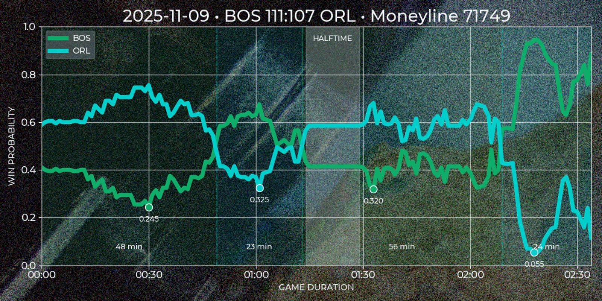
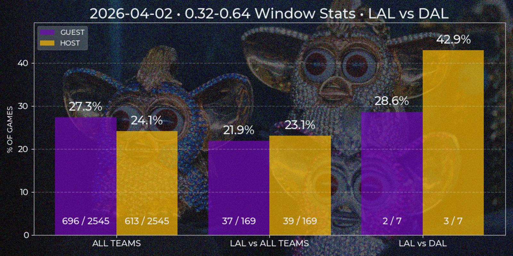

This service creates visual reports on Polymarket NBA-related event statistics.

## Examples

### Quote Series

Token quotes change history during a specific game with local price minima during underdog segments.



### Price Window

History of a team entering a specific price window in a game versus a specified team or all teams.



## Usage

The system is built around a RabbitMQ-based task processing model. A consumer subscribes to task queues, executes incoming tasks, and publishes results back to response queues.

Start RabbitMQ consumer:

```bash
python -m main
```
